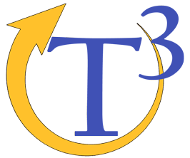
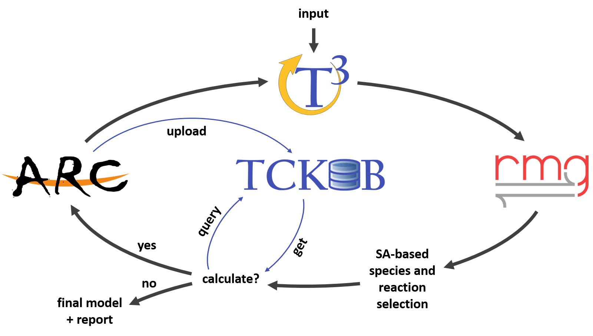

  

    <em>The Tandem Tool for automated kinetic model generation and refinement</em>

---

**Documentation**: <a href="https://reactionmechanismgenerator.github.io/T3/" target="_blank">
https://reactionmechanismgenerator.github.io/T3/</a>

**Source Code**: <a href="https://github.com/ReactionMechanismGenerator/T3" target="_blank">
https://github.com/ReactionMechanismGenerator/T3/</a>

---

!!! Note
    T3 is currently under intense development.
    Features described in these documentation pages
    which are still not implemented in the code will
    be marked with an asterisk (*).

## General

T3 is a tool for automatically generating refined kinetic models.

The key features are:

* **Convenient**: A single universal input file with an equivalent API,
  controlling all engines.
* **Flexible**: Supports all features of RMG and ARC, while maintaining
  reasonable defaults for simplicity.
* **Structured**: All outputs from all iterations are organized in an
  intuitive folder tree.
* **Easy**: Designed to be easy to use and learn.
* **Robust**: Captures lower-level exceptions, attempts to troubleshoot.
* **Restartable**: Has a convenient restart feature that's being triggered
  by identifying existing iteration outputs. 

## Principal workflow

  

At it's core, T3 iteratively calls
<a href="https://rmg.mit.edu/", target="_blank">RMG</a>
and an automated QM tool
(currently supporting only
<a href="https://reactionmechanismgenerator.github.io/ARC/", target="_blank">ARC</a>)
to generate a kinetic model and refine it, respectively.
The maximal number of iterations along with various control parameters
can be determined by the user.
Calculated thermodynamic properties and rate coefficients can optionally
be uploaded to the community cloud,
<a href="https://tckdb.github.io/TCKDB/", target="_blank">TCKDB</a>*.
T3 also queries TCKDB before instructing the automated QM tool to perform calculations.

## Intended audience

T3 is intended to be used by individuals with prior knowledge in chemical kinetic modeling,
and some experience in electronic structure (quantum chemical) calculations.
This documentation does not intend to provide advice for which levels of theory
should be used for particular systems although examples with specific levels of theory
are given.

## Requirements

Python 3.7+

T3 stands on the shoulders of giants:

* <a href="https://rmg.mit.edu/" class="external-link" target="_blank">RMG</a> for model generation.
* <a href="https://reactionmechanismgenerator.github.io/ARC/" class="external-link" target="_blank">ARC</a>
for automating electronic structure calculations.

## License

This project is licensed under the terms of the MIT license.
