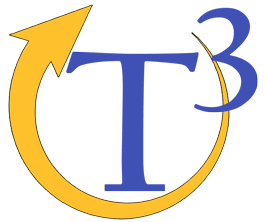
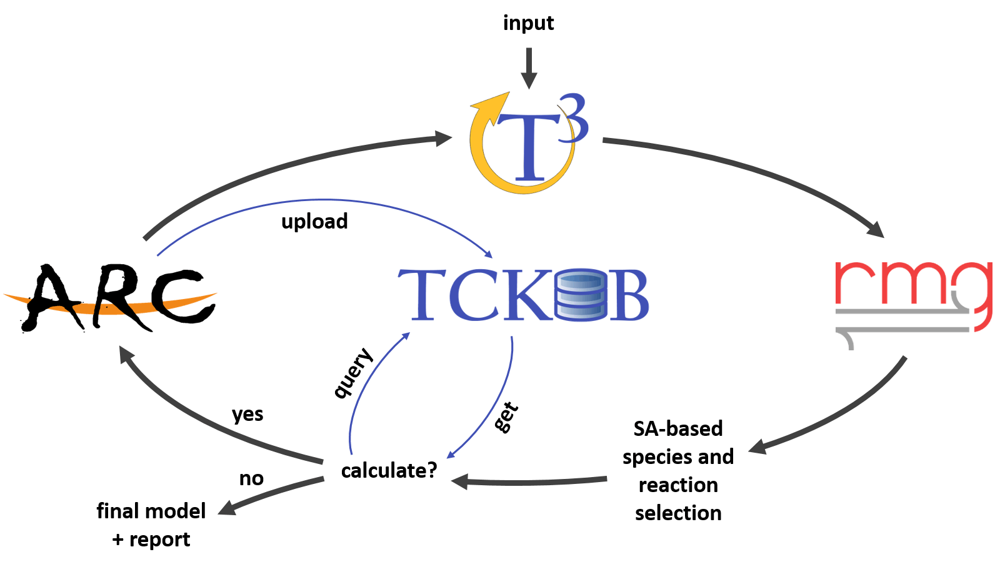

<p align="center">
  <a href="https://reactionmechanismgenerator.github.io/T3/">
  </a>
</p>
<p align="center">
    <em>The Tandem Tool for automated chemical kinetic model development</em>
</p>
<p align="center">
<a href="https://github.com/ReactionMechanismGenerator/T3/releases" target="_blank">
    
</a>

<a href="https://codecov.io/gh/ReactionMechanismGenerator/T3" target="_blank">
    
</a>
<a href="http://opensource.org/licenses/MIT" target="_blank">
    
</a>
<a href="https://www.python.org/" target="_blank">
    
</a>
</p>

---

**Documentation**: [T3 Documentation](https://reactionmechanismgenerator.github.io/T3/)

**Source Code**: [T3 Source](https://github.com/ReactionMechanismGenerator/T3)

---

## General

T3 is a tool for automatically generating refined kinetic models.

The key features are:

* **Convenient**: A single universal input file with an equivalent API,
  controlling all engines.
* **Flexible**: Supports all features of RMG and ARC, while maintaining
  reasonable defaults for simplicity.
* **Structured**: All outputs from all iterations are organized in an
  intuitive folder tree.
* **Easy**: Designed to be easy to use and learn.
* **Robust**: Captures lower-level exceptions, attempts to troubleshoot.
* **Restartable**: Has a convenient restart feature that's being triggered
  by identifying existing iteration outputs.

## Principal workflow

<p align="center">
  
</p>

At its core, T3 iteratively calls
<a href="https://rmg.mit.edu/" target="_blank">RMG</a>
and an automated QM tool
(currently supporting only
<a href="https://reactionmechanismgenerator.github.io/ARC/" target="_blank">ARC</a>)
to generate a kinetic model and refine it, respectively.

In each iteration:

1. **RMG** generates a kinetic model using the specified mechanism generation parameters.
2. **T3** runs **sensitivity analysis** (SA) on the generated model to identify the most
   influential reactions and species.
3. Species and reactions whose thermodynamic or kinetic parameters are uncertain
   and appear as important in the SA are sent to **ARC** for quantum mechanical
   calculation.
4. The refined parameters are fed back into RMG for the next iteration.

The maximal number of iterations along with various control parameters
can be determined by the user.


## Quick start

After [installation](installation.md), activate the environment and run
one of the [examples](examples.md):

```bash
conda activate t3_env
cd ~/Code/T3/examples/minimal
python -c "
from t3 import T3
import yaml

with open('input.yml') as f:
    args = yaml.safe_load(f)

t3_object = T3(**args)
t3_object.execute()
"
```

Or use the YAML input file directly:

```bash
python ~/Code/T3/T3.py input.yml
```

See the [tutorials](tutorials/1_no_qm.md) for step-by-step guides.


## Intended audience

T3 is intended to be used by individuals with prior knowledge in chemical kinetic modeling,
and some experience in electronic structure (quantum chemical) calculations.
This documentation does not intend to provide advice for which levels of theory
should be used for particular systems although examples with specific levels of theory
are given.

## Requirements

Python 3.12+

T3 stands on the shoulders of giants:

* <a href="https://rmg.mit.edu/" class="external-link" target="_blank">RMG</a> for model generation.
* <a href="https://reactionmechanismgenerator.github.io/ARC/" class="external-link" target="_blank">ARC</a>
for automating electronic structure calculations.
* <a href="https://cantera.org/" class="external-link" target="_blank">Cantera</a>
for mechanism simulation and sensitivity analysis.

## License

This project is licensed under the terms of the MIT license.
